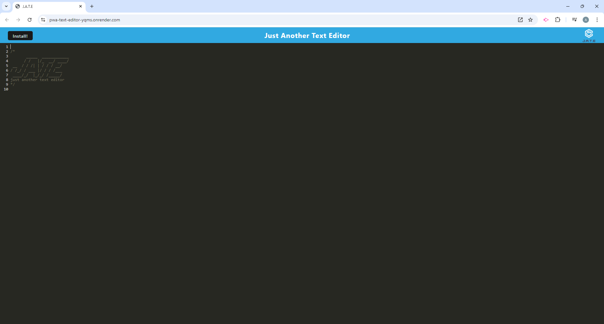
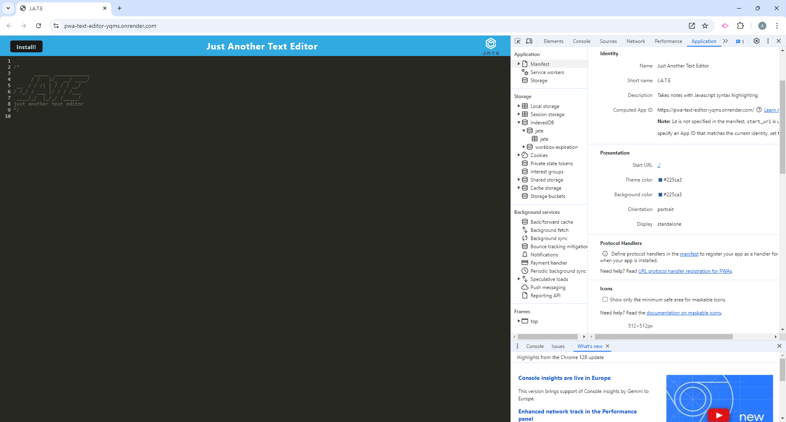
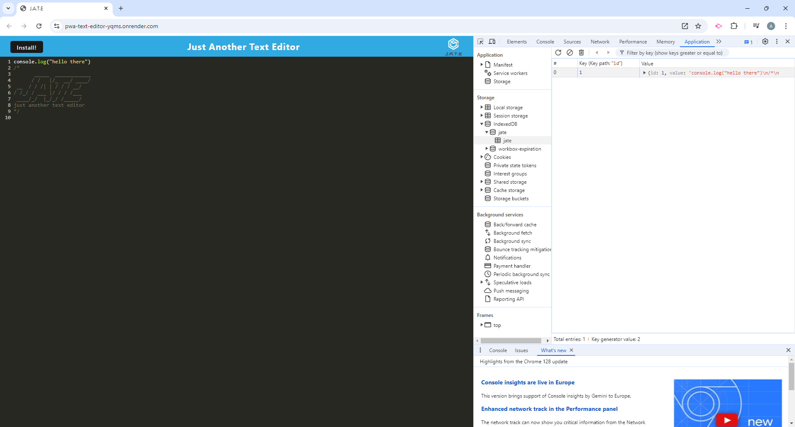
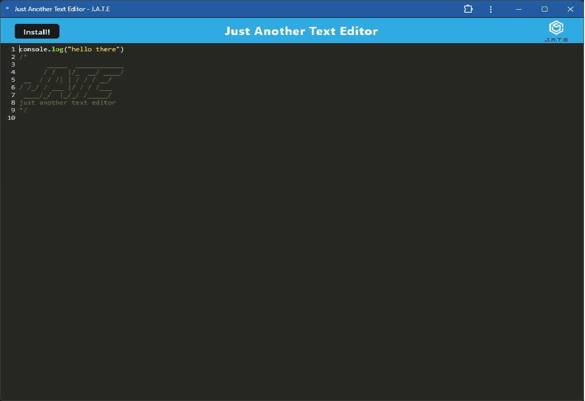

# pwa-text-editor

## Description

The goal of this project was to create a text editor application. The application will have the ability to be run in the browser or can be installed on a users personal machine. The application will also use an indexedDB database for storing and getting data and because of this will be able to run when a computer is offline.

## Installation

Render handles any installation that needs to be done to run the application.

## Usage

Below are screenshots showing the application in a browser, the application manifest, the indexedDB data, and the installed version of the application. There is also a link to the deployed application on render.

Link to the deployed application:
[https://pwa-text-editor-yqms.onrender.com/](https://pwa-text-editor-yqms.onrender.com/)

## Credits

N/A

## License

MIT License

## Contribute

N/A
